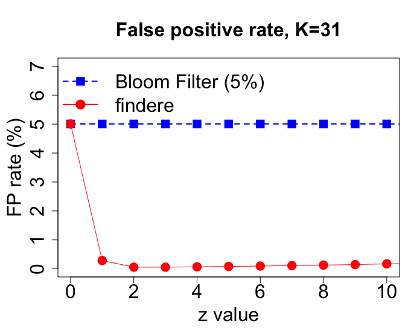

# findere

[](http://www.gnu.org/licenses/agpl-3.0.en.html)

`findere` is a simple strategy for speeding up queries and for reducing false positive calls from any Approximate Membership Query data structure (AMQ). With no drawbacks, queries are two times faster with two orders of magnitudes less false positive calls.



The `findere` implementation proposed here uses a Bloom filter as AMQ. It proposes a way to index and query Kmers from biological sequences (fastq or fasta, gzipped or not, possibly considering only canonical Kmers) or from any textual data. 

A library is proposed, hence `findere` can be easily adapted to any other AMQ, for any usage.

# Installation and execution
## Installation
You must first install zlib. It is likely to be already installed, if not you can try:
```bash
sudo apt update
sudo apt-cache search zlib
sudo apt-get install zlib # or wathever you found with apt-cache search
```

```bash
git clone --recursive https://github.com/lrobidou/findere
cd findere
git submodule update --init --recursive
chmod +x build.sh
./build.sh
```
## Execution
```bash
./bin/findere_index -i <lists of files to index> -o <index output> -k <k> -z <z> --epsilonpercent <epsilon in percent> -t <type of data you want to index>
./bin/findere_query -i <the index> -q <your query file> -k <k> -z <z> -t <type of data you indexed>
```
### Exemple on text files
```bash
./bin/findere_index -i data/texts/contemplations.txt,data/texts/Horace.txt,data/texts/Le_Cid.txt,data/texts/Maastricht.txt,data/texts/Othon.txt,data/texts/Lettres_persanes.txt -o poesie.bin -K 31 -z 5 -b 1000000 -t text
./bin/findere_query -i poesie.bin -q data/texts/AndromaqueAndHorace.txt -K 31 -z 5 -t text
```

### Execution on fasta files
```bash
./bin/findere_index -i "data/ecoli2.fasta","data/ecoli3.fasta","data/Listeria phage.fasta","data/Penicillium chrysogenum.fasta" -o indexFastas -K 31 -z 3 -b 10000000 5 -t fasta
./bin/findere_query -i indexFastas -q data/Listeria\ phage.fasta -K 31 -z 3 -t fasta
```

Be sure that parameters K and z matches between findere_index and findere_query.

To date, the last version of the library we use for our Bloom filters has an unsolved bug (https://github.com/mavam/libbf/blob/5478275d8a4e9a5cc163b44c34517c515bd898ec/src/hash.cpp#L13). For a high value of K, the hash function of Bloom filters crash. Thus, we experienced problems with a value of k > 36. Be carefull that K-z must be <= 36. If (K, z) is (37, 0) or (38, 1), findere_index will throw an exception. If (K, z) is (37, 1) or (38, 2), everything will be fine. 

## Sweet, but I already have a great AMQ data structure. How can I use `findere` to query it ?

If you want to use `findere` on another data structure (say, cuckoo filter), here is how you can do it:

In `src/libraries/utils/customAMQ.hpp`, you can find the class:
```c++
class customAMQ {
   public:
    customAMQ() = default;
    virtual ~customAMQ() = default;

    virtual bool contains(const std::string& x) const {
        std::cerr << "Should never be called." << std::endl;
        exit(1);
        return false;
    };
}
```

Any class that inherits `customAMQ` can be use with `findere`.Just wrap your data structure in it, and you are done. An exemple can be find in the file `src/query.cpp`. Let's break it down:

You have to inherit customAMQ, so:
```c++
class bfAMQ : public customAMQ {
```
As a private member, place your data structure. If I want to wrap a bloom filter, I would do:
```c++
   private:
    // juste one inner variable: the AMQ we are wrapping
    // (change this type depending on the data structure you want to use)
    bf::basic_bloom_filter* _bf;
```
Then, pass the data struture to your new object via the constructor:
```c++
   public:
    // pass the bloom filter to our constructor so wa can copy it and just store it
    bfAMQ(bf::basic_bloom_filter* bf) : _bf(bf) {
        //do nothing more
    }
```
Finally, expose a method `contains`, that takes a string as a parameter. This string is the kmer you'll want to query later:
```c++
    // finally, map the contains method to whatever the name of the method of our inner bloom filter
    bool contains(const std::string& x) const {
        // just pass the parameter to your amq
        return _bf->lookup(x);
    }

    //that's all folks
};
```
Done !

Now, before using `findere`, wrap your data structure.
Dont do:

```c++
std::vector<bool> response = findere::query(myFilterThatFindereDontKnowAnythingAboutfilter, querySeq, k, z);//findere can't handle it!
```
Do:
```c++
bfAMQ myAMQ = bfAMQ(myFilterThatFindereDontKnowAnythingAboutfilter);
std::vector<bool> response = findere::query(myAMQ, querySeq, k, z);
```

## Contacts

Lucas Robidou: lucas.robidou@inria.fr

Pierre Peterlongo: pierre.peterlongo@inria.fr

## Citation

Todo
